# Developer Guide

## Acknowledgements

{list here sources of all reused/adapted ideas, code, documentation, and third-party libraries -- include links to the
original source as well}

## Architecture

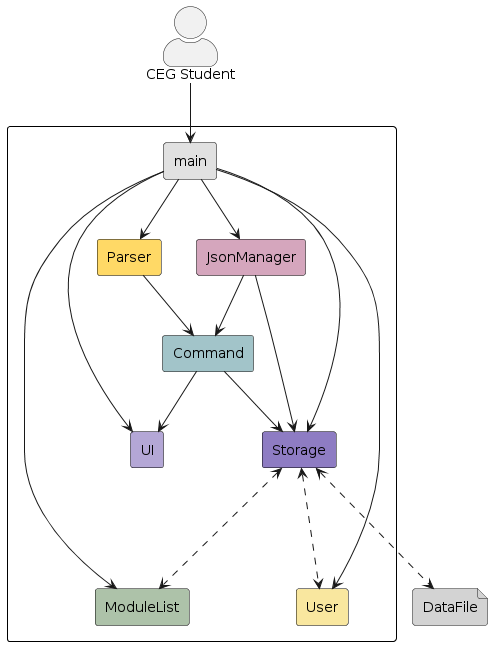

Below is an elaborate description of the UML diagram that outlines the structure and relationships of Architecture:

#### **Classes Involved:**
- **`FAP`**: The central class that initializes and coordinates the various components of the application.
- **`ModuleList`**: Manages a collection of academic modules.
- **`Ui`**: Facilitates all user interactions through a command-line interface.
- **`Parser`**: Interprets user input into executable commands.
- **`Command`**: Implements the logic necessary for executing commands identified by the `Parser`.
- **`User`**: Contains details about the user and their current semester.
- **`JsonManager`**: Handles operations related to reading from and writing to JSON files.
- **`Storage`**: Manages data storage and retrieval operations.

#### **Associations:**
- **`FAP`** has associations with:
    - **`ModuleList`** for managing academic modules.
    - **`Ui`** for handling inputs and outputs to and from the user.
    - **`Parser`** for converting user input into commands.
    - **`Command`** for executing actions based on user commands.
    - **`JsonManager`** and **`Storage`** for data persistence functionalities.

#### **Flow and Interactions:**
- The diagram centers on **`FAP`**, highlighting its role as the orchestrator for the application’s operations.
- It illustrates **`FAP`**'s interactions with components like **`Ui`**, **`Parser`**, **`JsonManager`**, and **`Storage`**, emphasizing a structured and controlled flow of operations.

This narrative emphasizes the `FAP` class's critical role in integrating the application's functionalities, showcasing its design focused on modularity, maintainability, and extensibility.

### Running the Application Loop

The `runApplication` method encapsulates the application's runtime loop, processing user commands until an exit condition is met (either through an error or the 'bye' command). This method highlights the application of polymorphism (via the `Command` class) and encapsulation, detailing interactions with other components.

```java
private static void runApplication() {
    Ui ui = new Ui();
    boolean continueRunning = true;

    while (continueRunning) {
        try {
            String userInput = ui.getUserCommand();
            LOGGER.log(Level.INFO, "User input: " + userInput);
            Command command = Parser.getCommand(userInput);
            command.execute(userInput);
            user.resetModuleStatuses();
            saveModulesToFile(filePath);
            if (userInput.equalsIgnoreCase(BYE)) {
                continueRunning = false;
                ui.close();
            }
        } catch (Exception e) {
            LOGGER.log(Level.SEVERE, "An error occurred: " + e.getMessage(), e);
            System.err.println("An error occurred: " + e.getMessage());
            ui.close();
            continueRunning = false;  // Exit loop on error
        }
    }
}
```

Below is a **Sequence diagram** that shows this application loop:
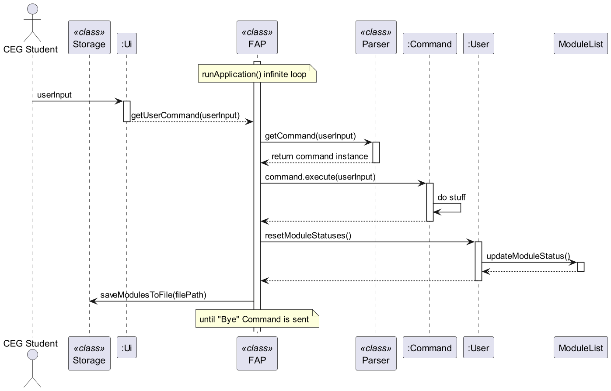

#### **Key Points:**

- **Error Handling**: Implements comprehensive error management that logs severe issues and terminates the application loop appropriately.
- **Command Processing**: It continuously processes commands through a loop that persists until 'bye' is entered or an exception is thrown, using polymorphic `Command` objects for executing a variety of actions.
- **Resource Management**: Ensures all resources are appropriately closed upon exiting the loop, reflecting prudent resource management practices (e.g., closing `Ui`).

This method is instrumental in understanding the dynamic interactions and procedural flow within the `FAP` application, highlighting the effective use of OOP principles like polymorphism and encapsulation to manage complex behaviors and state transitions efficiently.

### Overview

The application follows a layered architecture, with distinct components responsible for user interaction, data, 
storage, and logic. This design promotes modularity, maintainability, and extensibility, allowing for easy integration 
of new features and enhancements.

### Main Class: `FAP`

The `FAP` class serves as the central hub of the application, orchestrating the flow of execution and managing critical
resources. It embodies key software design principles and showcases thoughtful architectural decisions.

#### Design Overview

- **Singleton Components:** `FAP` manages singleton components such as `moduleList` and `LOGGER`, ensuring they are
  initialized once and accessible throughout the application's lifecycle.
    - `ModuleList`: A collection that holds modules, initialized with a capacity of 10.
    - `LOGGER`: Utilized for logging various levels of application events and errors.

- **Separation of Concerns:** The class delegates specific responsibilities to specialized classes, adhering to the
  principle of separation of concerns.
    - Interaction with users is managed by the `Ui` class.
    - Command parsing is delegated to the `Parser` class.
    - Command execution is handled by implementations of the `Command` interface.

- **Error Handling:** Demonstrates robust error handling strategies by catching and logging different exceptions, which
  ensures graceful handling of unexpected situations.

## Design

### UI Class

Code: [`Ui.java`](https://github.com/AY2324S2-CS2113-W14-3/tp/blob/master/src/main/java/seedu/duke/ui/Ui.java)

**Overview:**

The `Ui` class is responsible for handling all user interface interactions for the CEG (Computer Engineering) 
Future Academic Planner application. It provides methods for displaying messages, obtaining user input, printing 
schedules, module plans, and more.

The `Ui` class retrieves input from the user and passes it on to the `Parser`.

The `Command` class and its subclasses will call methods in Ui class for anything that needs to be printed.

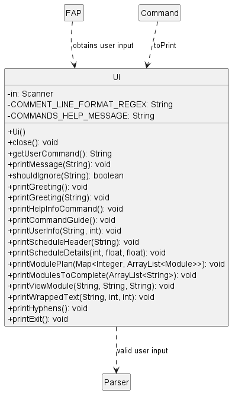

### User class
**Code** : [`User.java`](https://github.com/AY2324S2-CS2113-W14-3/tp/blob/master/src/main/java/seedu/duke/user/User.java)

The `User` class carries general information about the user of FAP.
As of `v2.1`, the user class is limited in functionality and only contain information about the user's
1. `name`
2. `current semester` of study

The `User` class is mainly utilized by SetCommand and ViewCommand through its getter and setter methods.

The main purpose of the `User` class is to introduce a basic level of personalization by allowing users to input and 
store their personal information. This information will be shown to the users through `Ui` class 
methods such as `printUserInfo()` and `printGreeting()`.

Additionally, the `User` class helps to verify the status of the modules in the user's plan, determining whether the 
modules have been taken or not.

### Parser package
**Code**:
- [`Parser.java`](https://github.com/AY2324S2-CS2113-W14-3/tp/blob/master/src/main/java/seedu/duke/parser/Parser.java)
- [`CommandMetadata.java`](https://github.com/AY2324S2-CS2113-W14-3/tp/blob/master/src/main/java/seedu/duke/parser/CommandMetadata.java)

The `Parser` class, together with the `CommandMetadata` class parses user input to
**return appropriate command objects** for the corresponding `Command` classes. If input validation fails or no
matching command is found, it returns an `Invalid` command instance.

**Overview:**

Below is a class diagram that shows the associations between `Parser` and `CommandMetadata`

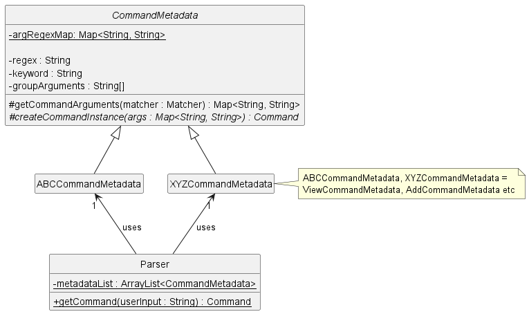

The`CommandMetadata` class is an abstract class that manages regular expressions (regex) and validation
for command arguments, allowing subclasses to generate specific **`Command` instances** based on **command keywords
and parsed arguments.** For every `Command` class, there would be a corresponding `CommandMetadata` class (with the
exception of `Invalid` command) that overrides the method `createCommandInstance` to generate the `Command` instance of
the specific `Command`.

The `Parser` class maintains a list of these `CommandMetadata` subclasses instances and iterates through them to
identify a given user command.

Further implementation details are available at "Parsing User Inputs" section under Implementation.

**How it works (Sequence):**

Below is a sequence diagram that shows how the `FAP` main method calls `Parser` to parse a `userInput`
for a `Command` to return:

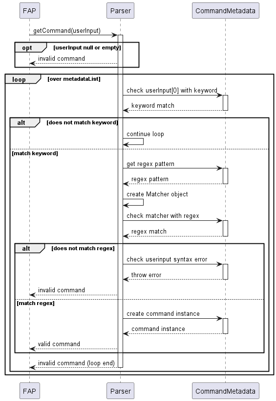

The method to parse and validate user inputs is handled in the `Parser` method `getCommand(String userInput)`:
1. `userInput` is first checked to see if it is null or empty. If either condition is met, `Parser` returns an 'Invalid'
   command instance.
2. The first `word` of the `userInput` string is then checked to see if it matches with a valid command
   `keyword` (Eg. `add`, `remove`, `view` etc)
3. If there is no match, return an `Invalid` command instance (on loop end)
4. If there is a match, the corresponding `CommandMetadata` class for the `keyword` is called upon,
   and there will be a further attempt to match the `userInput` string with the command `regex` expression
5. If it does not match, the `CommandMetadata` class will validate the error in user string syntax, print out
   an error message, and return an `Invalid` command instance
6. If it matches, the command `arguments` will be extracted out and the respective command class instance will be
   created based on the overwritten method `createCommandInstance` in the respective `CommandMetadata` class
---

### Storage


**Code** :
[`Storage.java`](https://github.com/AY2324S2-CS2113-W14-3/tp/blob/master/src/main/java/seedu/duke/storage/Storage.java)

The `Storage` class in the Future Academic Planner (FAP) application is essential for handling the persistence 
of user and module data. It allows the application to maintain state between sessions by reading from and writing 
to files.

As of `v2.1`, the `Storage` class is capable of handling several critical functionalities:
1. **Saving Data**: It serializes the `User` and `ModuleList` objects into a text format and writes this information 
to a specified file path.
2. **Loading Data**: It deserializes text data from a specified file path back into `User` and `ModuleList` objects.

### Key Functionalities

#### 1. **Saving User and Module Data**
- **Method**: `saveModulesToFile(String filePath)`
- **Description**: This method saves serialized user information and a list of taken modules to a specified file.
It first checks and, if necessary, creates the directory path provided in the filePath. It then initializes a 
`BufferedWriter` to write the data efficiently.

#### 2. **Loading User and Module Data**
- **Method**: `loadDataFromFile(String filePath)`
- **Description**: This method loads user information and module data from the specified file. If the file does not 
exist, it creates a new one and returns early to avoid errors. It reads the file line by line, updating the user and 
module data within the application.

#### 3. **File and Directory Management**
- **Methods**: `createFile(String filePath)`, `ensureDirectoryExists(String filePath)`
- **Description**: These methods manage the file system interactions necessary for reading from and writing to files, 
such as verifying directory existence and creating files as needed to prevent errors during the data load and 
save processes.

### Usage in Commands

- **SetCommand and ViewCommand**: These commands utilize the `Storage` class to persist changes to the user and 
modules immediately after modifications, ensuring data integrity and continuity.
- **Startup and Shutdown**: On startup, `loadDataFromFile` is invoked to initialize the application state, and 
on shutdown, `saveModulesToFile` is called to save the current state.

### Purpose

The main purpose of the `Storage` class is to abstract the complexities of file management and data serialization away 
from the core application logic. This simplification allows other parts of the application, such as commands and 
controllers, to interact with user and module data more efficiently and reliably.

Additionally, by handling data persistence, the `Storage` class ensures that user progress and configurations are not
lost between application sessions, thereby enhancing user experience and application reliability.

### Interaction with Other Classes

- **Interacts With**:
    - `User`: To save and load user-specific data like name and current semester.
    - `ModuleList`: To save and load the list of modules the user has taken.
    - `FileWriter`/`BufferedWriter`: Used within `saveModulesToFile` to write data to files.
    - `Scanner`/`FileReader`: Used within `loadDataFromFile` to read data from files.

This robust functionality provided by the `Storage` class is critical for maintaining the long-term usability 
and flexibility of the FAP application, making it a cornerstone of the application's architecture.

### Module, Module List
**Code**:
- [`Module.java`](https://github.com/AY2324S2-CS2113-W14-3/tp/blob/master/src/main/java/seedu/duke/modules/Module.java)
- [`ModuleList.java`](https://github.com/AY2324S2-CS2113-W14-3/tp/blob/master/src/main/java/seedu/duke/modules/ModuleList.java)

The `Module` class and `ModuleList` class work together to store the data of the modules added by the user

The `Module` class is responsible for containing the main attributes of a module such as moduleCode, moduleGrade, moduleMC, moduleTaken, moduleDate, gradedGradingBasis, and moduleDescription. These are relevant attributes that other classes use for certain actions done by the user.

The `ModuleList` class is responsible for managing the attributes contained in the `Module` class. They are mainly actions that value add to these attributes. For example, calculating the total amount of MC (module credit) the user has, calculating the GPA the user has, changing the grade of a certain mod, or adding a new module.

Hence, these are not just simple getters and setters, instead actions that value add to the attributes of the `Module` class, letting the user use them for different purposes in real life.

This design allows a separation of concern which separates the purpose of each of these two classes and ultimately leads to higher cohesion and lower coupling.

Below is the class diagram of how the module and modulelist class interacts with other relevant classes 

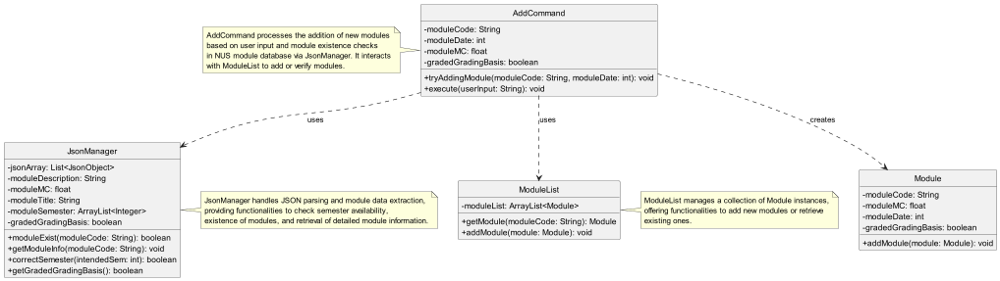

### Command

Here's how the `Command` class interact with the other classes:

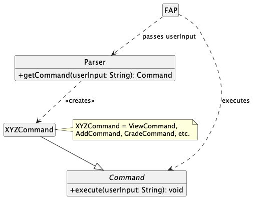

How the `Command` component works (together with other classes):

1. When the user's input is received in `FAP.java`, it is passed into the `Parser` class which then creates an instance
   of the `Command` object.
2. The object would be a specific implementation of the `Command` class (i.e. `AddCommand`, `ViewCommand`, etc.)
3. The specific `Command` subclass would then be present in `FAP.java` as a new `Command` object
4. `execute()` is then called on the object to perform its task.

## Implementation
This section describes some noteworthy details on how certain features are implemented.

### Parsing User Inputs

**Use of regular expressions (Regex) in FAP:**

The add command class requires a user input that best matches this string
```
add c/COURSECODE w/SEMESTERTAKEN
```
where `COURSECODE` and `SEMESTERTAKEN` have their defined restrictions: `COURSECODE` should best match an actual
course code at NUS, `SEMESTERTAKEN` should be a number value in some range. The `COURSECODE` and `SEMESTERTAKEN`
will thus have their own argument regex pattern.

A simple regex example would be that `SEMESTERTAKEN` would be a number ranging from 1-8 to represent a normal honours
pathway for a CEG student (FAP's target user). A regex pattern for that could look like `w/(?<semester>[1-8])` (In this
case, `w/` is used as a `delimitter` but it is not **strictly** neccessary **unless** the `regex` have special
conditions such as allowing whitespaces). An **argument name capturing group** `semester` is enclosed within the
brackets so that the argument group will be **named** and thus the argument value (anywhere between `1-8`) can be
referenced/called and retrieved by using the `Matcher` method `group()` with the argument `"semester"`.
Meanwhile, the java utility classes `Pattern` and `Matcher` would handle the checks that the argument value given
is indeed between `1-8`.

A userInput regex for FAP would thus follow this convention:
```
keyword argument_1 argument_2 ...
```
This full regex pattern for a command itself can be generated by having a `keyword`, as well as all the
argument `group names` (a name to use so as to _reference_ the argument) and the argument `regex` pattern
corresponding to that name reference. Typically, these arguments should be spaced out and thus a `\s+` (representing
at least one whitespace character) is placed between the gaps of the regex pattern for
`keyword, argument_1, argument_2...`

While regex allows the `userInput` checks to be prudent, as well as potentially offering the flexibility for string
inputs to allow a different order of arguments, there are limitations where it becomes hard to determine the exact
error of the user's input solely based on the regular expressions, because it solely returns a true/false value
if the string value itself fits the `regex` criteria given). Regardless, we think the use of regex in FAP can help provide
us **safety in the arguments** that passes through to the commands via the userInput.

**Developer usage FAP: Parser & CommandMetadata class as of `v2.1`**: **How to create a new command**

- First, we need a `Command` type class to return as an object. In the future, this may be expanded to any `T` type.
- Second, we need a string that would be used to create this `Command` instance. This string should follow the
  format `keyword argument_1 argument_2...` where the `keyword` is mandatory, `argument_1, argument_2...`
  are **optional**.
- Third, for every argument available, make a **regex pattern with name capturing** that encloses the value within the
  brackets. (e.g., `n/(?<name>[A-Za-z0-9 ]+)`, `g/(?<grade>[ab][+-]?|[cd][+]?|f|cs)`)

**Using example `add c/COURSECODE w/SEMESTERTAKEN`**
- Create a subclass that extends `CommandMetadata`.
- Put in the `keyword` (e.g., `add`) and `groupArgumentNames` (e.g., `{"courseCode", "semester"}`) in the superclass
  constructor.
- Define the argument regex pattern in the static variable `argsRegexMap` with the corresponding `groupArgumentName` and
  argument `regex` pattern.
    - Note: Currently `argsRegexMap` is in the superclass `CommandMetadata`
      (e.g., `argRegexMap.put("semester", "w/(?<semester>[1-8])")`).
- Override the method `createCommandInstance(Map<String, String> args)` to implement the method on how to create
  the `Command` object you want. Return the `Command` instance.
    - Note: `Map<String, String> args` contains the `groupArgumentName : argumentValue` pairing.
- In the `Parser` class, add the created `CommandMetadata` subclass to `metadataList`.
- The `Parser` method `getCommand(String userInput)` will help validate the `userInput`. If the `userInput` matches
  the string you wanted, then `getCommand(String userInput)` will return the Command instance you require.

Sample `CommandMetadata` example code:
```java
public class AddCommandMetadata extends CommandMetadata {
private static final String ADD_KEYWORD = "add";
private static final String[] ADD_ARGUMENTS = {"courseCode", "semester"};

public AddCommandMetadata() {
    super(ADD_KEYWORD, ADD_ARGUMENTS);
}

// Add Command Creator
@Override
protected Command createCommandInstance(Map<String, String> args) {
    String moduleCode = args.getOrDefault("courseCode", "COURSECODE_ERROR");
    String semester = args.getOrDefault("semester", "SEMESTER_ERROR");
    int semesterInt = Integer.parseInt(semester);
    
    return new AddCommand(moduleCode, semesterInt);
}
```

`v2.1`: **Optional** regex arguments is now supported (eg. `userInput` regex expressions `view` and `view c/COURSECODE`
can now be both valid). This feature is still under testing.

**Here is an extended developer usage guide:**
- For every argument that can be optional, a new `String[]` has been introduced. This String[] should match the
  length of the regular `String[]` containing the argument names. Each element in this new array should indicate whether
  the corresponding argument is optional or mandatory. For instance, if `courseCode` is mandatory, and `semester` is
  optional:

```java
private static final String[] ADD_ARGUMENTS = {"courseCode", "semester"};
private static final String[] ADD_ARG_FLAGS = {"mandatory", "optional"};
```

- Put the new `String[]` inside the superclass constructor, an example is as follows:

```java
public AddCommandMetadata() {
    super(ADD_KEYWORD, ADD_ARGUMENTS, ADD_ARG_FLAGS);
}
```

- Otherwise, if all argument `regex` is mandatory, there is no need to include it in the superclass constructor:

```java
public AddCommandMetadata() {
    super(ADD_KEYWORD, ADD_ARGUMENTS);
}
```
---


### Saving modules to file

The `Storage` class is responsible for managing the persistence of user and module data to and from files. This document section focuses on the `saveModulesToFile` method, which saves the current user's information and their module list to a specified file path.

#### Method: `saveModulesToFile`

```java
public static void saveModulesToFile(String filePath) throws StorageException {
    try (BufferedWriter writer = new BufferedWriter(new FileWriter(filePath))) {
        writer.write(toString(user) + System.lineSeparator());
        for (Module module : moduleList.getTakenModuleList()) {
            writer.write(toString(module) + System.lineSeparator());
        }
    } catch (IOException | SecurityException e) {
        throw new StorageException("An error occurred while saving modules to file: " + filePath);
    }
}
```

#### Parameters:
- `filePath` - The path of the file where the data is to be saved.

#### Throws:
- `StorageException` - if an error occurs during the file writing process.

#### Process Description:

1. **File Writing Setup**:
    - Initializes a `BufferedWriter` wrapped around a `FileWriter` to write text to the file efficiently. 
    This setup benefits from buffered writing, which minimizes the number of physical disk writes.

2. **Writing User Data**:
    - The user's data is converted to a string format and written to the file first, followed by a 
    newline character to separate entries clearly.

3. **Writing Modules Data**:
    - Iterates over the list of taken modules (`moduleList.getTakenModuleList()`), converting each module 
    to a string format and writing it to the file. Each module entry is written on a new line.

4. **Resource Management**:
    - The `BufferedWriter` is declared within a try-with-resources statement, ensuring that it is closed at 
    the end of the statement block, regardless of whether the operation completes successfully or fails.

#### Error Handling:
- Catches `IOException` and `SecurityException`, throwing a `StorageException` with a message detailing the failure. 
    This encapsulation of exceptions provides a clear API for the method, simplifying error handling for the caller.

### UML Sequence Diagram Explanation

Below is the UML sequence diagram for the `saveModulesToFile` method, illustrating the interactions 
between components during the file-saving process.

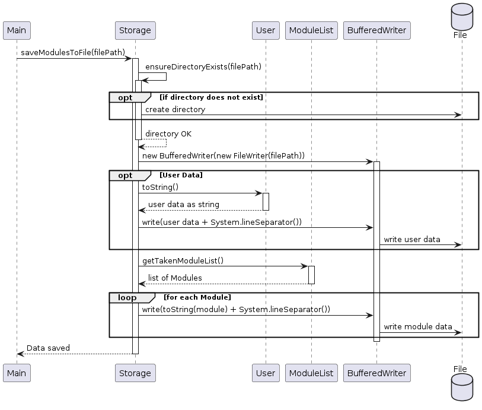

#### Steps Illustrated in the Diagram:

1. **Main Initiates Save**:
    - The `FAP` class (or the main method) calls `saveModulesToFile`, passing the file path where 
    data needs to be saved.

2. **Storage Operations**:
    - **Directory Check**: Verifies or creates the necessary directory.
    - **File Writer Setup**: Sets up the `BufferedWriter` and `FileWriter`.
    - **Data Writing**:
        - Writes user data.
        - Iteratively writes data for each module in the `ModuleList`.

3. **Completion**:
    - Once all data is written, the `BufferedWriter` is closed (implicitly by the try-with-resources), 
    which also flushes the buffer to the file, finalizing the write operation.

#### Conclusion:
This sequence diagram and the corresponding detailed explanation provide a clear, step-by-step guide 
to the `saveModulesToFile` method's operations, highlighting how data integrity and error handling are maintained.

### Commands

#### View Commands

User input is passed to `Parser.getCommand()`, which determines that the input contains the keyword `view`, which
branches out depending on whether it is followed by a `c/COURSE_CODE` (refer to the `Parser` implementation
on how it detects optional inputs).

- #### View Schedule (without `c/COURSE_CODE`)

1. Calls `ModuleList.getModuleMySemester()`.
2. Subsequently, calls `Ui.java`'s `printScheduleHeader()`, `printModulePlan()`, and `printScheduleDetails()`.

- #### View Specific Course Information (with `c/COURSE_CODE`)

1. Checks if the course exists in NUS AY23/24 by calling `JsonManager.moduleExist()`.
2. In the event the method returns `false`, else it
   calls `JsonManager.queryModuleInfo()` to get the module's relevant details (i.e. course title, MCs and description).
3. It prints out a statement stating the module does not exist if point 1. returns false, else it prints out the
   module information.

The following diagram illustrates how the `ViewCommand` operates when `execute()` is called:

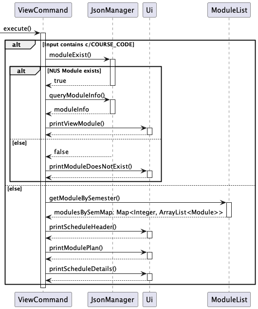

- #### View Courses Needed to Graduate
  This feature is implemented under the `ViewGraduateCommand` instead of the previous `ViewCommand` as it is invoked
  under a different keyword (i.e. `graduate`).

1. User input is passed into `Parser.getCommand()`, it returns an instance of `ViewGraduateCommand` and `FAP.java` will
   call its `execute()` method.
2. It gets the modules left to complete by `ModuleList.getModulesToComplete()` which loops over all the modules in the
   user's `ModuleList` and checks it against `CEGModules` to see if it is a valid CEG Module, or if its equivalent
   exists (e.g. CP3880 and EG3611A).
3. If the exact module is found in `CEGModules`, the module and its equivalent will not be added to
   the `modulesToComplete`.
4. `printModulesToComplete()` is called and prints out the required modules based on the `modulesToComplete`.

The following diagram illustrates how `ViewGraduateCommand` operates when its `execute()` method is called:

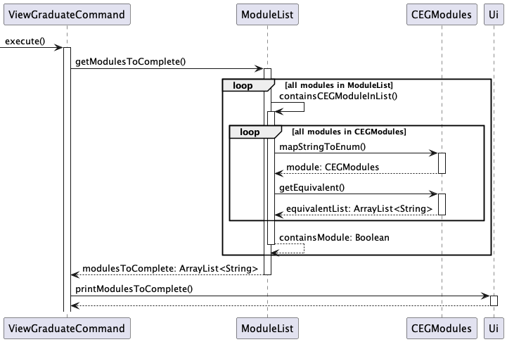

### Adding a Module ###

#### **Classes Involved:**
- **`Module`**: Manages the important attributes of an academic module.
- **`ModuleList`**: Manages a collection of academic modules.
- **`JsonManager`**: Handles operations related to reading from and writing to JSON files.
- **`AddCommand`**: Check for the state of module (whether it exist in NUS and already exist in ModuleList) and
  handle them appropriately

**`Module` Class:**
- Purpose
    - Represents an academic module, holding information such as the module code, credits (MCs), grade, and description.
- Key Methods
    - **`setModuleGrade(String moduleGrade)`**  
      Sets the grade for the module. Validates the grade format and throws `ModuleException` if the module hasn't been
      taken yet.
    - **`getGradeNumber()`**  
      Returns a numerical value associated with the module's grade, used for GPA calculation.

**`ModuleList` Class:**
- Purpose
    - Manages a collection of `Module` objects. It facilitates operations such as adding, removing, retrieving modules,
      calculating GPA, and grouping modules by semester.

- Key Methods
    - **`addModule(Module module)`**  
      Adds a new module to the list. Throws `IllegalArgumentException` if the module is `null`.
    - **`getModule(String courseCode)`**  
      Retrieves a module by its course code. Throws `ModuleNotFoundException` if the module is not found.
    - **`removeModule(Module module)`**  
      Removes a specified module from the list.
    - **`changeModuleGrade(String moduleCode, String grade)`**  
      Changes the grade of a module identified by its course code.
    - **`tallyGPA()`**  
      Calculates and returns the GPA based on the modules in the list.
      Throws `GpaNullException` if there are no modules
      with countable grades
    - **`groupModulesBySemester()`**  
      Groups modules by their semester and returns a map where each key is a semester, and each value is a list of
      modules in that semester.

#### **Flow and Interactions:**
- Main point of entry is `AddCommand` class where it will check the user commands passed by the Parser class. The check is to see if the module exist in NUS and in the moduleList.
- If the module exist in NUS and is not a duplicate (does not exist in moduleList), then the `addModule` method in ModuleList is called which will instantiate a `Module` object
- If the module does not exist in NUS or is a duplicate, an exception is throw which are shown are below,

#### Error Handling
- `ModuleAlreadyExistException`: Thrown if there are duplicate modules in ModuleList
- `ModuleNotFoundException`: Thrown if module does not exist in the NUS list of modules
- `WrongSemesterException`: Thrown if the user attempts to add a module in a semester which it is not available to be taken in

---
### Getting module details from Json File (JsonManager Class):

#### Overview

The `JsonManager` class is designed to manage and interact with module information stored in a JSON format. It
provides functionalities for checking the existence of modules, retrieving module information such as Modular
Credits (MCs), description, and title from a JSON file.

#### Constructor:

- `JsonManager()`: Initializes a new instance of the `JsonManager` by loading the module information from a JSON
  file located at `/moduleInfo.json`.

#### Methods:

- Module Existence

    - **`moduleExist(String moduleCode)`**: Checks if a module with the specified code exists in the JSON data.
        - **Parameters**: `String moduleCode` - The code of the module to check for existence.
        - **Returns**: `boolean` - `true` if the module exists, `false` otherwise.

- Module Information Retrieval

    - **`getModuleInfo(String moduleCode)`**: Retrieves detailed information about a module, including its Modular
      Credits, description, and title, based on the module code.
        - **Parameters**: `String moduleCode` - The code of the module for which information is to be retrieved.
        - **Note**: This method updates the internal state of the `JsonManager` object with the retrieved module
          information.

- Information Accessors

    - **`getModuleDescription()`**: Returns the description of the last module queried.
        - **Returns**: `String` - The description of the module.

    - **`getModuleMC()`**: Returns the Modular Credits of the last module queried.
        - **Returns**: `int` - The Modular Credits of the module.

    - **`getModuleTitle()`**: Returns the title of the last module queried.
        - **Returns**: `String` - The title of the module.

#### Error Handling

- The constructor throws a `RuntimeException` if the JSON file containing module information cannot be found or
  accessed, ensuring that the application is aware of missing or inaccessible module data.

#### Usage

```java
JsonManager jsonManager = new JsonManager();
if (jsonManager.moduleExist("CS1010")) {
   jsonManager.getModuleInfo("CS1010");
   System.out.println("Module Title: " + jsonManager.getModuleTitle());
   System.out.println("Module Description: " + jsonManager.getModuleDescription());
   System.out.println("Module MC: " + jsonManager.getModuleMC());
}
```
Below is a sequence diagram that shows the flow of the implementation when a module is added by the user.
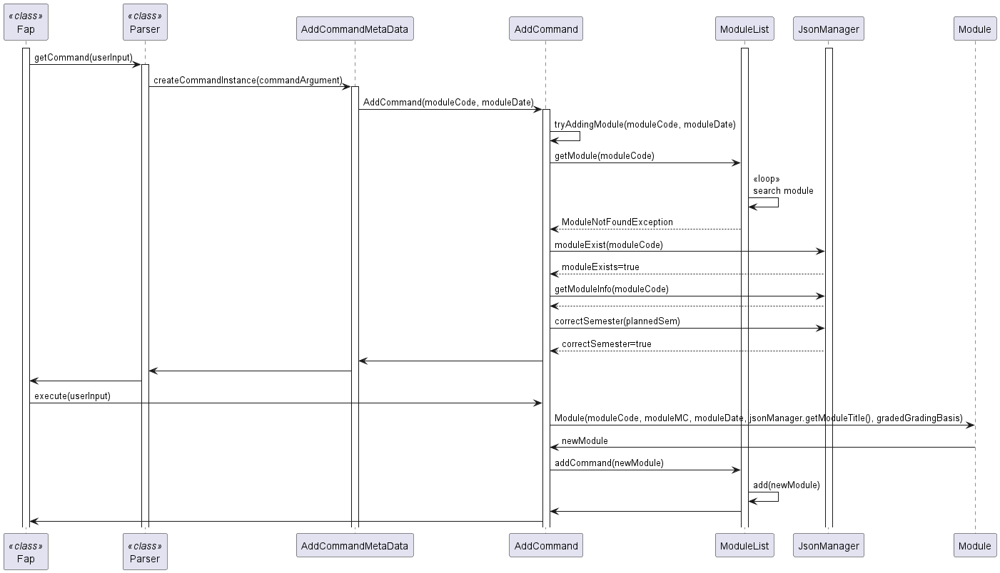

--- 


1. **Application Initialization and Entry Point:**

   The `main` method, as the application's entry point, performs initial setups such as greeting the user and ensuring
   critical components are initialized properly. It encapsulates high-level flow control and implements error handling
   to manage assertion errors and unexpected exceptions.

   ```java
   public static void main(String[] args) {
       try {
           printGreeting();
           assert moduleList != null : "moduleList should not be null";
           runApplication();
       } catch (AssertionError e) {
           LOGGER.log(Level.SEVERE, "Assertion failed: " + e.getMessage(), e);
           System.err.println("Critical assertion failure: " + e.getMessage());
       } catch (Exception e) {
           LOGGER.log(Level.SEVERE, "An unexpected error occurred: " + e.getMessage(), e);
           System.err.println("An unexpected error occurred: " + e.getMessage());
       }
   }
   ```
   #### UML Diagram

   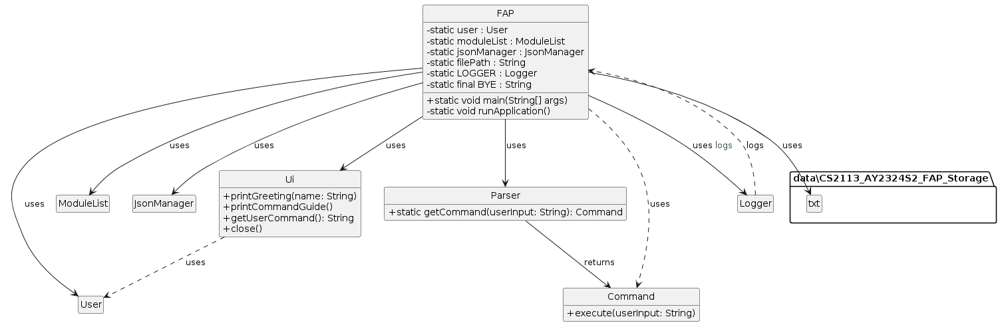

### UML Diagram Description


4. **Viewing GPA**

   The `ViewGpaCommand` class is responsible for displaying the current GPA attained by the student. It
   accesses `ModuleList`, which looks through all `Module` object contained in the list. If the `Module` is marked as
   taken and has been assigned a valid grade with `GradeCommand` by the user, its grades will be included into the
   calculation.

   This is the formula used for tabulation of GPA.
```
GPA = SUM(Course Grade Point * Course Units) / SUM(Course Units Counted Towards GPA)
```

   Below is the sequence diagram for `ViewGpaCommand`.
   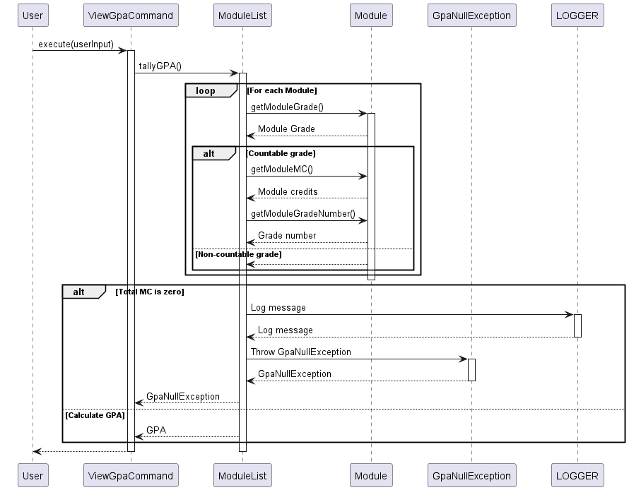

7. **Feasbility of desired gpa**

The `DesiredGpaCommand` class executes the program to calculate if desired GPA is feasible. 

Checking for feasibility depends on several conditions: 
- The current GPA
- The number of MCs taken (excluding mods that are S or CS)
- The number of MCs user plan to take by graduation
- The number of MCs left to take
- The desired GPA

Firstly, the current GPA will be obtained via tallyGPA() in moduleList. This will also tabulate the current number MCs 
taken based on the number of modules that have been assigned a grade in the planner. One thing to look out for will be
modules that have been assigned S or CS, as those modules will not be accounted for in GPA calculation, but will affect
the number of MCs that the user have yet to take.

Next, the program will tabulate the GPA needed for the remaining MCs in order to achieve desired GPA when combined with 
current GPA. This is based on the formula
```
Desired GPA = (Current GPA * MCs taken) + (GPA to attain * MCs not taken) / (total MCs)
```

NOTE:
- Total MCs is the total number of MCs that get contributes to GPA by graduation, thus not accounting for modules that 
are CS/CU.
- In this version, we assume user will only take a maximum of 160MCs. In future implementations, the user can change 
that option, which will affect the GPA to attain.
- In this version, if user has already inputted more than 160MCs worth of modules, the code will throw an exception and 
stop.

If (GPA to attain) calculated is more than 5 or less than 0, it means that it is not feasible to reach the desired GPA.

If (GPA to attain) is feasible, we will try to find the easiest way to achieve desired GPA. As there are many different 
combinations, we will just work with two grades closest to (gpa to attain), the one directly above (named upperBound) 
and directly below (named lowerBound).

For example, if (GPA to attain) is 4.25, then upperBound will be "A-" (grade = 4.5), and lowerBound will be "B+" (grade
= 4.0).

Note:
- Assume the remaining modules to be taken are all 4 MCs

Initialise a variable, mockGPA, to keep track of the future GPA. mockGPA is initialised to lowerBound grade value.

Using a while loop:
- Checks if mockGPA is above (GPA to attain)
- If yes, we will need one more upperBound grade
- Else, the user can just take one more lowerBound grade
- Update mockGPA
- Stop the loop once total MCs is reached

After the final iteration, mockGPA could be below (GPA to attain) as adding one more lowerBound grade can push mockGPA 
to be lower than (GPA to attain). To fix this, we just need to increment number of upperBound by 1 and decrement number
of lowerBound by 1.

With this, we can find the least number of upperBound grade the user need to attain to achieve their desired GPA.

Below is the sequence diagram of the entire function:
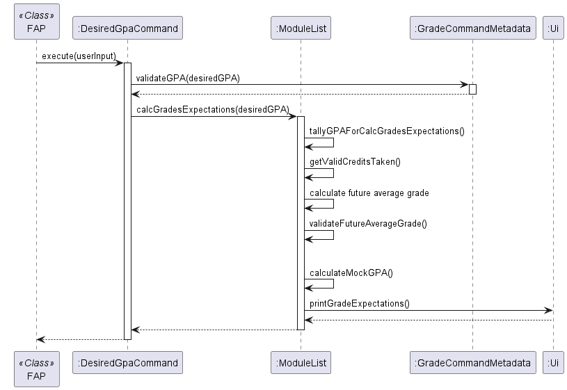

## Product scope

### Target user profile

{Describe the target user profile}

### Value proposition

{Describe the value proposition: what problem does it solve?}

## User Stories

| Version | As a ... | I want to ...             | So that I can ...                                           |
|---------|----------|---------------------------|-------------------------------------------------------------|
| v1.0    | new user | see usage instructions    | refer to them when I forget how to use the application      |
| v2.0    | user     | find a to-do item by name | locate a to-do without having to go through the entire list |

## Non-Functional Requirements

{Give non-functional requirements}

## Glossary

* *glossary item* - Definition

## Instructions for manual testing

Important note: The provided test cases are independent of each other, test cases that require multiple entries of
command will be explicitly stated. All provided test cases are assumed to be executed fresh after launch.

- [Launching and Termination](#launching-and-termination)
- [Add](#add)
- [Remove](#remove)
- [View](#view)
    - [Taken Modules](#taken-modules)
    - [Module Information](#module-information)
    - [Modules to Graduate](#modules-to-graduate)
- [Set Grade](#set-grade)
- [GPA](#gpa)
- [Desired GPA](#desired-gpa)
- [Storage](#storage)

---

### Launching and Termination

#### Launching

1. Ensure you have `java 11` or above installed on your computer

2. Download the latest `FAP.jar` from [here](https://github.com/AY2324S2-CS2113-W14-3/tp/releases)

3. Copy the file `FAP.jar` to a new empty folder

4. Open a command terminal in the directory of the folder, and use `java -jar FAP.jar` to run the application
5. The list of available commands should show upon a successful launch as show below:

    ```
    ~\FAPTesting>java -jar FAP.jar
    _____________________________________________________________
    Hello! This is your CEG Future Academic Planner!
    What would you like to do today?
    _____________________________________________________________
    Available Commands:
    NOTE: "<WORD>" represents a user-typed argument that is required for the command
    1. set n/<NAME> curr/<CURR_SEM> - Set name & current semester
    2. add c/<COURSE_CODE> w/<WHEN> - Add a module to your schedule
    3. remove c/<COURSE_CODE> - Remove a module from your schedule
    4. grade c/<COURSE_CODE> g/<GRADE> - Add or change a module grade
    5. gpa - View your GPA
    6. desiredgpa <GPA> - Calculates grades needed to achieve a desired GPA
    7. view - View modules on your schedule
    8. view c/<COURSE_CODE> - View selected module information
    9. graduate - View remaining core modules and MCs left to graduate
    10. help - View command syntax and list of commands available for FAP
    11. bye - Exit the program
    
    Argument format:
    <NAME>: Alphabetic characters and optionally spaces between
    <CURR_SEM>: Valid semester from 1-8
    <COURSE_CODE>: Valid NUS course code from AY23-24
    <WHEN>: Valid semester from 1-8
    <GRADE>: Alphabetic grade (A+, A, A-, B+, B, B-, C+, C, D+, D, F, CS, S)
    <GPA>: Number from 0 to 5
    _____________________________________________________________
    ```

6. A new folder `data` in the same directory as `FAP.jar` should be created and initialized
   with `CS2113_AY2324S2_FAP_Storage.txt`.

#### Termination

1. Exit FAP using the `bye` command.
2. An exit message should be displayed as follows:

    ```
    bye
    _____________________________________________________________
    Bye. Enjoy your studies!
    ```

#### [Back to Manual Testing](#instructions-for-manual-testing)

---

### Add

#### Adding a module:

1. Test Case: `add c/CS2113 w/4`

   **Expected result:** Module added, success message printed.


2. Test Case: (The following test case requires multiple lines of inputs)

    ```
    add c/CS2113 w/4
    add c/CS2113 w/4
    ```
   **Expected Result:** Module not added, error message printed saying duplicate module.


3. Test Case: `add c/AB1234 w/1`

   **Expected result:** Module not added, error message printed saying modules does not exist in NUS.

#### [Back to Manual Testing](#instructions-for-manual-testing)

---

### Remove

1. Test Case: (The following test case requires multiple lines of inputs)

    ```
    add c/ST2334 w/4
    remove c/ST2334
    ```
   **Expected Result:** Module removed, successful remove message printed.


2. Test Case: `remove c/ST2334`

   **Expected Result:** Module not removed (was not added in the first place), module not found message printed.

#### [Back to Manual Testing](#instructions-for-manual-testing)

---

### View

#### Taken Modules

1. Test Case: `view`

   **Expected Result:** Prints out an empty table of modules,
   along with Anonymous as the user's name, and several other default statistics as shown:
    ```
    _____________________________________________________________
    CEG Study Plan for: Anonymous
    _____________________________________________________________
    | Y1S1 [Sem 1] | Y1S2 [Sem 2] | Y2S1 [Sem 3] | Y2S2 [Sem 4] |
    _____________________________________________________________
    | Y3S1 [Sem 5] | Y3S2 [Sem 6] | Y4S1 [Sem 7] | Y4S2 [Sem 8] |
    _____________________________________________________________
    - Current Study: Semester 1
    - Total MCs taken: 0.00 / 160
    - Total MCs listed: 0.00 / 160
    _____________________________________________________________

    ```

2. Test Case: (The following test case requires multiple lines of inputs)

    ```
    add c/CS2113 w/4
    add c/CS1010 w/1
    add c/ST2334 w/6
    set n/JohnDoe curr/6
    view 
    ```

   **Expected Results:** Table filled with modules based on what was previously added, categorized based on when it was
   taken, along with updated user data and other statistics as shown below:

    ```
    _____________________________________________________________
    CEG Study Plan for: JohnDoe
    _____________________________________________________________
    | Y1S1 [Sem 1] | Y1S2 [Sem 2] | Y2S1 [Sem 3] | Y2S2 [Sem 4] |
    |CS1010        |              |              |CS2113        |
    _____________________________________________________________
    | Y3S1 [Sem 5] | Y3S2 [Sem 6] | Y4S1 [Sem 7] | Y4S2 [Sem 8] |
    |              |ST2334        |              |              |
    _____________________________________________________________
    - Current Study: Semester 6
    - Total MCs taken: 12.00 / 160
    - Total MCs listed: 12.00 / 160
    _____________________________________________________________

    ```

#### Module Information

1. Test Case: `view c/CS2113T`

   **Expected Results:** Prints out module information as shown below:

    ```
    =================================================================================
    | Title: Software Engineering & Object-Oriented Programming          Credits: 4 |
    =================================================================================
    | Description: This course introduces the necessary skills for systematic and   |
    | rigorous development of software systems. It covers requirements, design,     |
    | implementation, quality assurance, and project management aspects of          |
    | small-to-medium size multi-person software projects. The course uses the      |
    | Object Oriented Programming paradigm. Students of this course will receive    |
    | hands-on practice of tools commonly used in the industry, such as test        |
    | automation tools, build automation tools, and code revisioning tools will be  |
    | covered.                                                                      |
    =================================================================================
    ```


2. Test Case: `view c/AB1234`

   **Expected Results:** Prints out message saying module does not exist in NUS AY23/24:

    ```
    _____________________________________________________________
    No such module found in NUS AY23-24!
    _____________________________________________________________
    ```

#### Modules to Graduate

1. Test Case: `graduate`

   **Expected Results:** Prints out all CEG Modules to be completed by default.


2. Test Case: (The following test case requires multiple lines of inputs)

    ```
    add c/CP3880
    graduate
    ```

   **Expected Results:** Prints out all CEG Modules to be completed, except for `CP3880` and its equivalent `EG3611A`.


3. Test Case: (The following test case requires multiple lines of inputs)

    ```
    add c/GEC1015
    graduate
    ```

   **Expected Results:** Same as first test case as `GEC1015` is a valid NUS module, but is not a necessary module for a
   CEG student.


4. Test Case: (The following test case requires multiple lines of inputs)

    ```
    add c/GEA1000
    graduate
    ```

   **Expected Results:** Prints out all CEG Modules to be completed, except for `GEA1000`.

#### [Back to Manual Testing](#instructions-for-manual-testing)

---

### Set Grade

1. Test Case: (The following test case requires multiple lines of inputs)

    ```
    add c/GEA1000
    grade c/GEA1000 g/A+
    ```

   **Expected Results:** Updates grade, prints out grade successfully updated message.


2. Test Case: `grade c/GEA1000 g/A+`

   **Expected Results:** Grade not updated, prints out module note found in list message.


3. Test Case: (The following test case requires multiple lines of inputs)

    ```
    add c/GEA1000
    grade c/GEA1000 g/L
    ```

   **Expected Results:** Grade not updated, prints out invalid grade format/order message.

#### [Back to Manual Testing](#instructions-for-manual-testing)

---

### GPA

1. Test Case: `gpa`

   **Expected Results:** Prints out message stating no grades available to calculate.


2. Test Case: (The following test case requires multiple lines of inputs)

    ```
    add c/GEA1000
    add c/GEC1015
    grade c/GEA1000 g/A+
    grade c/GEC1015 g/A-
    gpa
    ```

   **Expected Results:** Prints out calculated GPA.

#### [Back to Manual Testing](#instructions-for-manual-testing)

---

### Desired GPA

{provide manual testing for desired GPA}

#### [Back to Manual Testing](#instructions-for-manual-testing)

---

### Storage

1. Use `java -jar FAP.jar` to run the application
2. Test Case: (The following test case requires multiple lines of inputs)

    ```
    add c/CS2113 w/4
    add c/CS1010 w/1
    add c/ST2334 w/6
    set n/JohnDoe curr/6
    bye
    ```
    **Expected Results:** Application should terminate successfully, and the data should be saved to the file.


3. Use `java -jar FAP.jar` to run the application
4. Test Case: `view`

   **Expected Results:** Table filled with modules based on what was previously added, categorized based on when it was
taken, along with updated user data and other statistics as shown below:

    ```
    _____________________________________________________________
    CEG Study Plan for: JohnDoe
    _____________________________________________________________
    | Y1S1 [Sem 1] | Y1S2 [Sem 2] | Y2S1 [Sem 3] | Y2S2 [Sem 4] |
    |CS1010        |              |              |CS2113        |
    _____________________________________________________________
    | Y3S1 [Sem 5] | Y3S2 [Sem 6] | Y4S1 [Sem 7] | Y4S2 [Sem 8] |
    |              |ST2334        |              |              |
    _____________________________________________________________
    - Current Study: Semester 6
    - Total MCs taken: 12.00 / 160
    - Total MCs listed: 12.00 / 160
    _____________________________________________________________

    ```


#### [Back to Manual Testing](#instructions-for-manual-testing)

---

