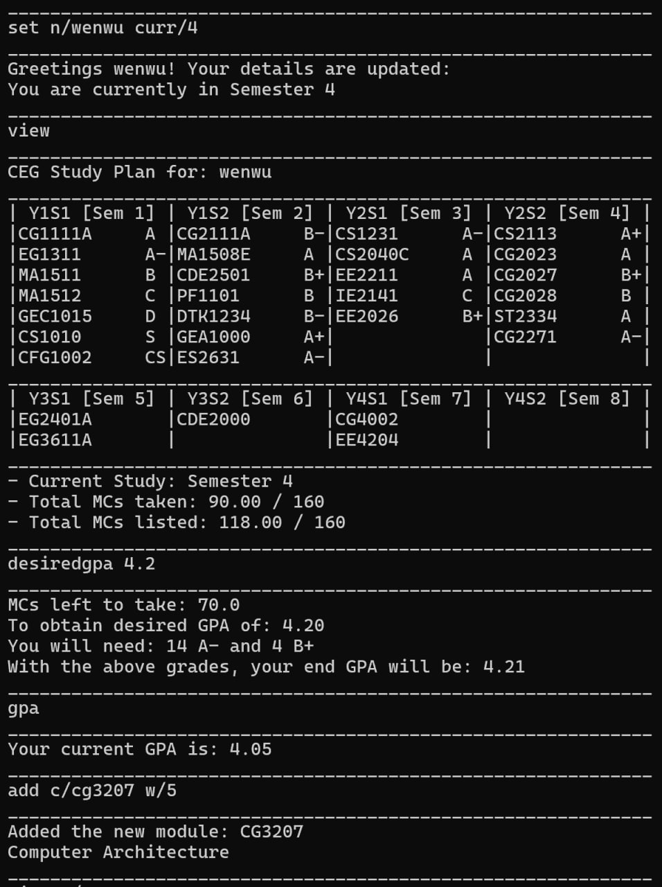

# Future Academic Planner (FAP)

Future Academic Planner (FAP) is a robust academic management software designed to help streamline the academic journey 
for NUS Computer Engineering (CEG) students. If you can type fast, FAP can get your module planning done faster than 
traditional GUI apps.

### Useful Links:
- [User Guide](UserGuide.md)
- [Developer Guide](DeveloperGuide.md)
- [About Us](AboutUs.md)

## Acknowledgements

This project is based on the AddressBook-Level3 project created by the [SE-EDU initiative](https://se-education.org). 
We extend our gratitude to the SE-EDU team for providing the project template and extensive documentation which were 
invaluable to this project.

### External Resources Utilized:
- **NUSMods API**: Used for retrieving detailed module information ([NUSMods](https://nusmods.com))
- **Gson Library**: Employed for JSON deserialization to handle module data effectively
([Gson GitHub](https://github.com/google/gson))

We would like to express our special thanks to:
- **Professor Akshay, Madhanse**, and the rest of the CS2113T teaching team for their guidance and support throughout 
- this project.
- The **NUSMods team** for maintaining their API which is crucial for accessing up-to-date module information.
- **Google**, for developing and maintaining Gson which greatly simplified our data handling processes.

This project is part of the CS2113T module offered by the School of Computing at the National University of Singapore.
